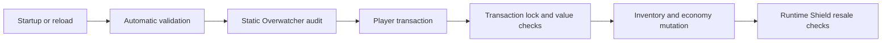

# Transaction Safety and Overwatcher

ZaminShop protects transactions at several different stages. These systems are complementary rather than interchangeable.

## Protection layers



## Automatic validation

Before configuration becomes active, ZaminShop checks:

- configuration compatibility;
- menu schema and references;
- shop packs, categories, items, and command mappings.

Validation is automatic during startup and reload. The previous working snapshot is restored when a menu reload fails.

[Read the validation report guide](../validation.md)

## Transaction safety

Transaction safety controls:

- one active transaction per player;
- lock timeout;
- click cooldown;
- optional inventory-open blocking;
- optional low-TPS circuit breaker;
- rollback-aware mutation flow.

Keep these defaults enabled:

```yaml
transaction-safety:
  enabled: true
  per-player-lock: true
  lock-timeout-ms: 5000
  click-cooldown-ms: 150
  block-while-inventory-open: false
  debug-failures: false
```

## Currency safety

Currency-value rules moved to `currency.yml`:

```yaml
safety:
  enabled: true
  decimal-places: 2
  reject-prices-with-too-many-decimals: true
  minimum-transaction-value: 0.01
  normalize-player-balances-for-checks: true
  block-nan-infinity: true
  max-transaction-value: 1000000000000
```

These rules reject invalid precision, non-finite numbers, and unreasonable transaction values before money changes hands.

## Static Overwatcher audit

Overwatcher analyzes loaded physical shop items for:

- sell prices above buy prices;
- high sell-to-buy ratios;
- direct cross-shop resale profit;
- supported crafting and compaction profit.

It analyzes each currency provider independently.

Possible levels:

- `WARNING`: review recommended;
- `CRITICAL`: affected listings can be blocked.

## Reviewing findings

```text
/zaminshop overwatcher list
```

Each line includes:

- level;
- finding ID;
- shop and item;
- material;
- buy and sell values;
- currency provider ID;
- reason.

Confirm one intentional relationship:

```text
/zaminshop overwatcher confirm A1B2C3D4
```

Confirmations persist in `overwatcher-confirmations.yml`.

Clear confirmations and rebuild findings:

```text
/zaminshop overwatcher reset
```

## Runtime Shield

Static audits can detect configured price relationships. Runtime Shield protects the exact items delivered to players.

It:

- signs purchased items;
- verifies signatures during sale;
- compares purchase and sale unit prices within the same provider;
- blocks profitable resale;
- blocks invalid ZaminShop purchase signatures;
- temporarily locks affected listings;
- optionally notifies console and administrators.

Configure it in [overwatcher.yml](overwatcher-yml.md).

## Suspicious transaction monitoring

This system watches player activity rates and value generation, including:

- transactions per ten seconds;
- money earned per minute;
- items sold per minute;
- repeated same-item sales.

It can warn administrators and optionally block selling temporarily.

## Sell limits

Sell limits cap legitimate economic output. They are not exploit detection.

Use them to cap:

- daily sale income;
- weekly sale income;
- daily item volume;
- weekly item volume.

## Production recommendation

Keep automatic validation, transaction safety, currency safety, Overwatcher, and Runtime Shield enabled. Tune thresholds after observing real server behavior rather than disabling protection globally.
